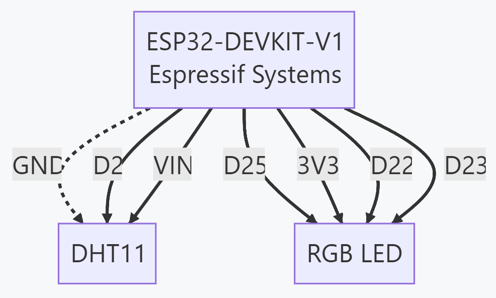

# Cloud-Connected IoT System using ESP32, MQTT, and Node-RED

## Author
**Neelash Kannan Annadurai**  
HWU Elect Electronic & Comp Eng, Heriot Watt University  
Edinburgh, United Kingdom  
na3018@hw.ac.uk

---

## Table of Contents
- [Abstract](#abstract)
- [Introduction](#introduction)
- [System Architecture](#system-architecture)
- [Hardware Overview](#hardware-overview)
- [Software Overview](#software-overview)
- [Results](#results)
- [Conclusion](#conclusion)
- [Future Work](#future-work)
- [Keywords](#keywords)

---

## Abstract
This project demonstrates the implementation of a cloud-connected IoT system using the **ESP32 microcontroller**, **MQTT protocol**, and **Node-RED** for data processing and visualization. MongoDB is used for data storage and analytics. The system collects temperature and humidity data from a DHT11 sensor and provides remote control of an RGB LED via a dynamic Node-RED dashboard. The system focuses on low-bandwidth communication, real-time control, and scalable data storage to showcase how IoT can be used to create adaptive, intelligent environments.

---

## Introduction
The **Internet of Things (IoT)** enables devices to communicate, exchange data, and operate autonomously over the internet. This project integrates an **ESP32 microcontroller** with **DHT11 sensors**, **RGB LED**, **MQTT** for efficient communication, and **Node-RED** for dashboard creation. The setup allows remote monitoring and control, demonstrating IoT's potential in smart homes, healthcare, agriculture, and industrial automation.

### Key Technologies
- **ESP32 DoIT Microcontroller**: Core processing unit for data acquisition and control.
- **MQTT**: Lightweight messaging protocol optimized for IoT.
- **Node-RED**: Low-code development platform for creating interactive dashboards.
- **MongoDB**: NoSQL database for storing sensor data.

---

## System Architecture
The network architecture consists of:
- **ESP32 Microcontroller**: Connects to a WiFi network and communicates with the MQTT broker.
- **MQTT Broker (Mosquitto)**: Facilitates message exchange between the ESP32 and Node-RED.
- **Node-RED Dashboard**: Visualizes sensor data and controls the RGB LED.
- **MongoDB Database**: Stores historical data for analysis.
- 

### MQTT Topics
- **Published**: 
  - `assignment2/temperature` (Temperature data)
  - `assignment2/humidity` (Humidity data)
  - `assignment2/status` (Device status)
- **Subscribed**:
  - `assignment2/led` (LED control)

---

## Hardware Overview
### Components
- **ESP32 DoIT Dev Kit**: A versatile microcontroller with built-in WiFi and Bluetooth.
### ESP32 DevKit

- **DHT11 Sensor**: Measures temperature and humidity.
### DHT11 Sensor

- **RGB LED**: Indicates temperature changes and can be remotely controlled.

### RGB LED

### Circuit Diagram
The ESP32 is connected to the DHT11 sensor and RGB LED via GPIO pins, allowing data collection and visual feedback.

---

## Software Overview
### Development Environment
- **PlatformIO (VS Code Extension)**: Used for coding the ESP32.
- **Libraries**:
  - `WiFi.h` for WiFi connectivity
  - `PubSubClient` for MQTT communication
  - `DHT.h` for sensor data collection

### Node-RED Setup
- Install Node-RED using `npm install -g node-red`.
- Configure MQTT nodes for data subscription and publication.
- Create a dashboard with gauge, chart, and button nodes for real-time interaction.

---

## Results
### Key Achievements
- **Data Communication**: Real-time data exchange between ESP32 and MQTT broker.
- **Device Control**: Remote control of RGB LED through Node-RED dashboard.
- **Data Visualization**: Real-time and historical data visualization using Node-RED charts.
- **Data Storage**: Sensor data is stored in MongoDB for long-term analysis.

### Dashboard Highlights
- **Temperature & Humidity Monitoring**: Gauges and charts for real-time sensor data.
- **LED Control**: Interactive controls for adjusting LED color and brightness.
- **Historical Data Analysis**: Fetches data from MongoDB and visualizes trends.

---

## Conclusion
This project successfully integrates the **ESP32 microcontroller**, **MQTT protocol**, **Node-RED**, and **MongoDB** to build a scalable IoT system with cloud connectivity. It demonstrates efficient data communication, remote device control, and data analytics, highlighting the potential of IoT in creating adaptive smart environments.

### Key Outcomes
- Real-time monitoring and control of IoT devices.
- Effective data visualization and user interaction through Node-RED.
- Scalable cloud-based data storage and analytics using MongoDB.

---

## Future Work
- **Expand Sensor Network**: Add additional sensors for comprehensive environmental monitoring.
- **Enhance Security**: Implement SSL/TLS for secure MQTT communication.
- **Mobile App Integration**: Develop a mobile application for easier access and control.
- **AI Integration**: Use machine learning for predictive analytics and smart automation.

---

## Keywords
Internet of Things (IoT), ESP32, MQTT, Node-RED, MongoDB, Cloud Connectivity, Data Visualization, Remote Control, Sensor Data, Smart Environments, Low-Code Development, Data Analytics, Real-Time Monitoring.

---

## References
1. Node-RED Documentation
2. MQTT Protocol Specifications
3. MongoDB NoSQL Database Documentation
